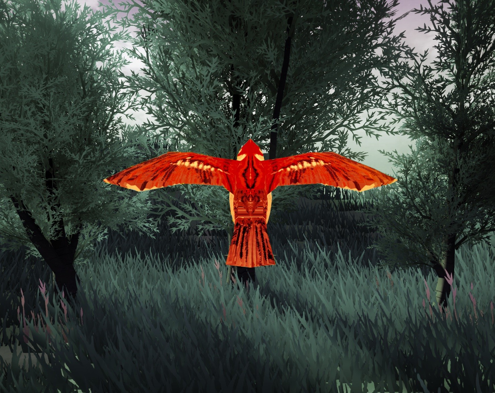
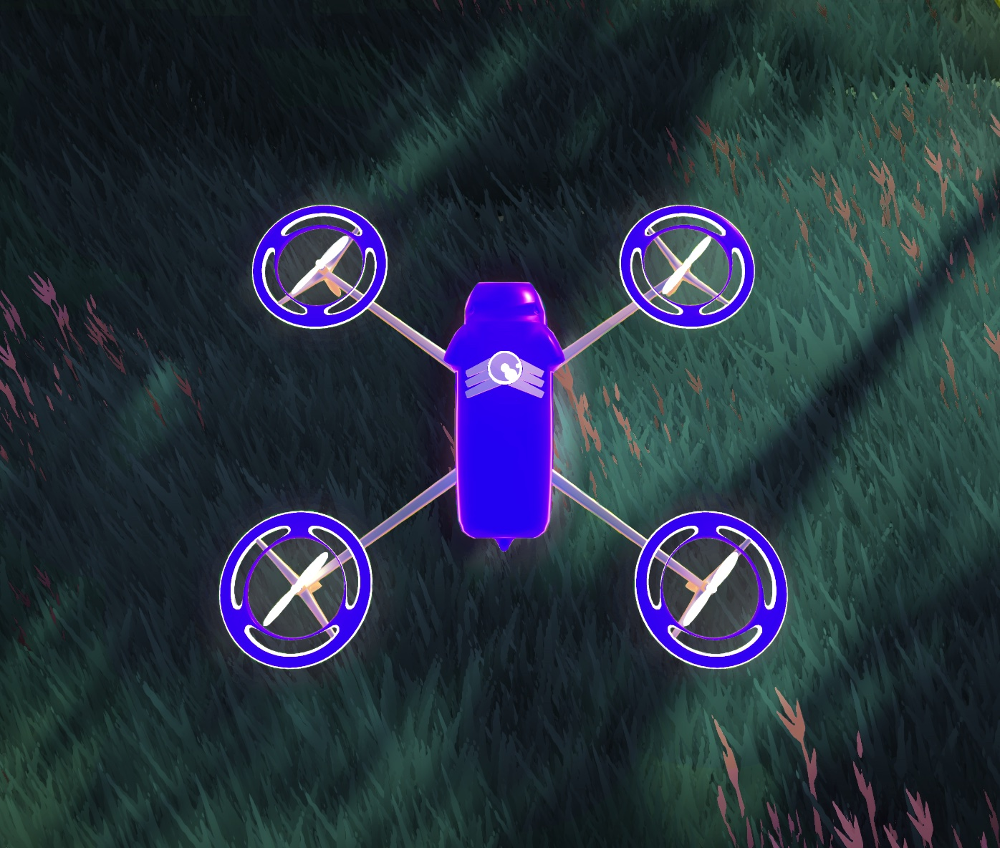
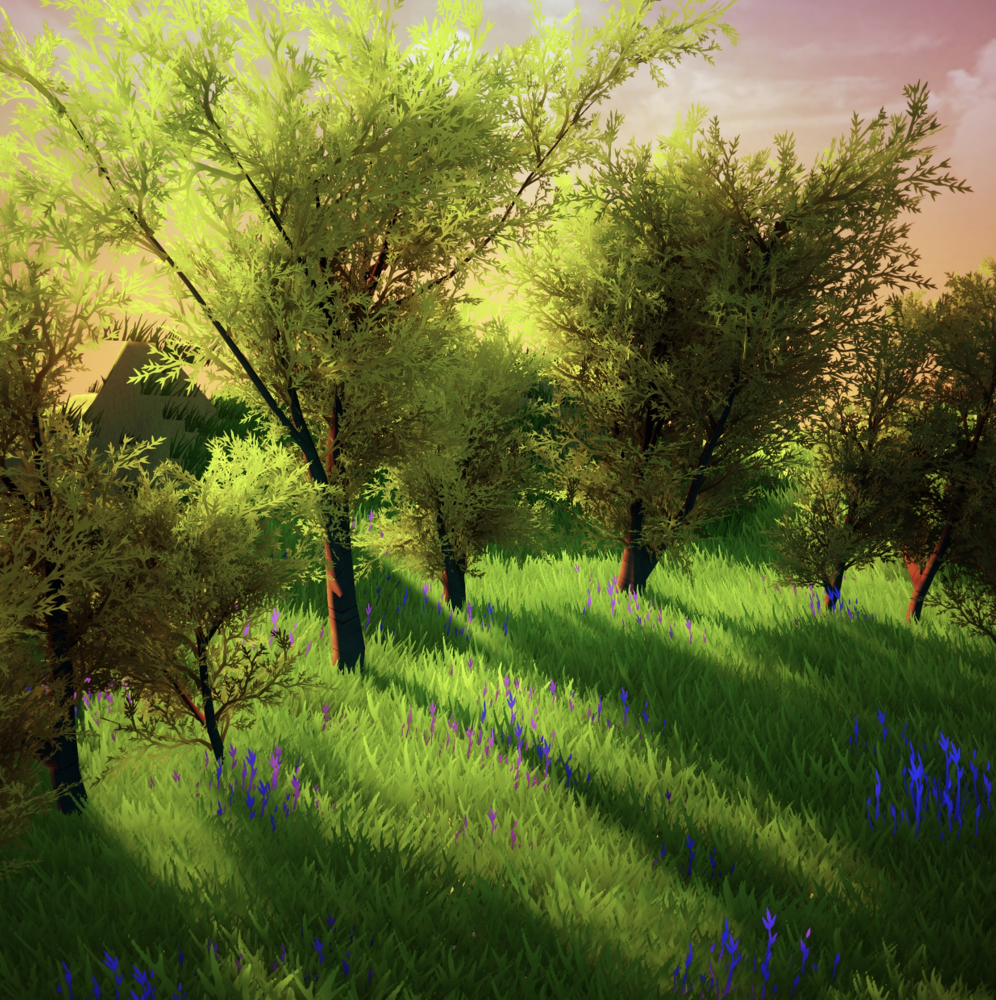

# Assets Guide

The assets used in our unity simulation are freely available, however, their licence prohibit us to share the assets without linking to the original creators.
Instead, we will give below a list of all assets we have used, and how you can obtain the assets by yourself.

## Bird

The bird 3D model stems from the collection “Living Birds” from the author “dinopunch” that is publicly available at the Unity asset store under the following link:

https://assetstore.unity.com/packages/3d/characters/animals/birds/living-birds-15649

The collection not only provides the left shown bird we used in our simulations, but also other breeds.

## Drone

The drone 3D models are part of the collection “Simple Drone” from the author “GameAnime” that is publicly available at the Unity asset store under the following link:

https://assetstore.unity.com/packages/3d/vehicles/air/simple-drone-190684

## Forest Environment

The forest environment is a collection of useful assets that all stem from the same Unity package – “Nature Starter Kit 2” from the author “Shapes”. It is publicly available at the Unity asset store under the following link:

https://assetstore.unity.com/packages/3d/environments/nature-starter-kit-2-52977
