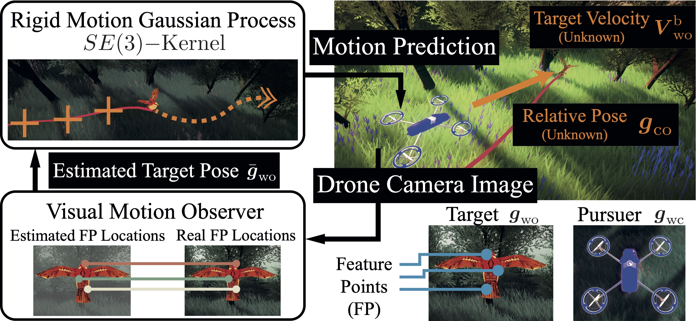

# Rigid Motion Gaussian Processes with SE(3) Kernel and Application to Visual Pursuit Control

This repository includes the simulation files for the L-CSS 2023 letter
`Rigid Motion Gaussian Processes for Visual Target Tracking and Rotation-Aware Kernels on SE3`.

A YouTube video of the simulation is uploaded [here][YT].  
Check the guide [getting started](GETTING_STARTED.md) for how to use this repository.

> **NOTE:** Our asset licences do not permit us to share the unity asset files like the bird, drones, and forest environment.
> However, all used assets are freely available and can be obtained by yourself.
> Please refer to the [assets guide](ASSETS.md) on how to obtain the assets.

Please also refer to the following projects that are used by this repository:

- [VPC Library][VPC]
- [ROS-TCP-Connector][ROS-TCP-Connector]
- [Docker-ROS][DOCKER-ROS]

| Key | Notes |
| --- | --- |
| [](https://www.scl.ipc.i.u-tokyo.ac.jp) | [Fujita Laboratory, The University of Tokyo](https://www.scl.ipc.i.u-tokyo.ac.jp) |

## How to clone this repository

Clone this repository with all its subdependencies to your local machine:

```bash
git clone --recurse-submodules <REPO_URL>
```

If you cloned the project without its submodules, please instruct git to load all submodules by this command within the project folder:

```bash
git submodule update --init --recursive
```

## How to cite

The paper has not yet been fully published.
The section will be updated in time.

## Contact

In case of questions or possible collaborations, please visit our homepage:

[https://www.scl.ipc.i.u-tokyo.ac.jp](https://www.scl.ipc.i.u-tokyo.ac.jp)

Alternatively, you can contact us via e-mail:

```http
Marco Omainska: marcoomainska _at_ g.ecc.u-tokyo.ac.jp
```

[YT]:https://youtu.be/yf2JhwhPAoA
[VPC]:https://github.com/marciska/vpc-library
[ROS-TCP-Connector]:https://github.com/Unity-Technologies/ROS-TCP-Connector
[DOCKER-ROS]:https://github.com/wojas/docker-mac-network
